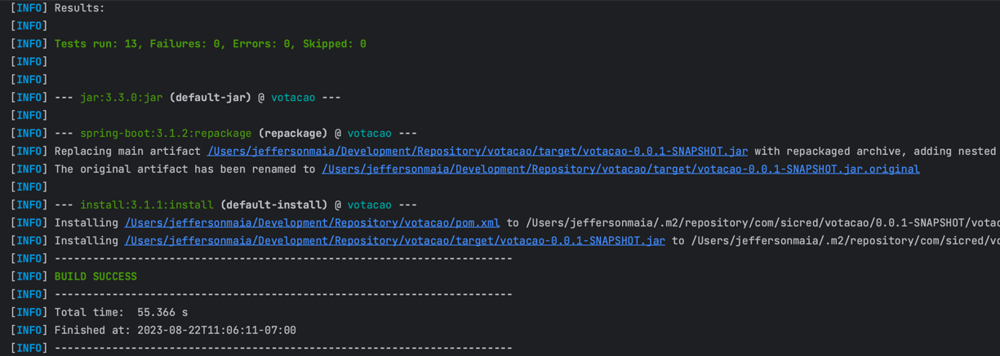

# Sistema de Votação de Associado
Sistema que permite a votação de associados em uma determinada pauta.

## Funcionalidades
- Cadastrar uma nova pauta
- Abrir uma sessão de votação em uma pauta (a sessão de votação deve ficar aberta por um tempo determinado na chamada de abertura ou 1 minuto por default)
- Receber votos dos associados em pautas (os votos são apenas 'Sim'/'Não'. Cada associado é identificado por um id único e pode votar apenas uma vez por pauta)
- Contabilizar os votos e dar o resultado da votação na pauta

### Tarefa bônus
- Tarefa Bônus 1 - Integração com sistemas externos
  * OBS: O Serviço não estava disponível foi utilizado anotação para validar o CPF
- Tarefa Bônus 3 - Performance
  *
- Tarefa Bônus 2 - Mensageria e filas
- Tarefa Bônus 4 - Versionamento da API
  * v1/pauta
  * v2/pauta
  * v1/voto

## Tecnologias
- Java 17
- Spring Boot 3
- Maven 3
- JUnit 5
- Mockito
- Swagger
- PostgreSQL
- Kafka
- H2 Database
- Docker
- Docker Compose

## Execução
Para executar o projeto é necessário ter o Maven e o Docker instalado na máquina. Após isso, basta executar o comando abaixo na raiz do projeto:

```bash
mvn clean install
```

Após o build da imagem, basta executar o comando abaixo para subir o container:

* Caso seja a primeira vez que o container é executado, é necessário executar o comando abaixo para criar o tópico no Kafka:
```bash
docker-compose up --build
```
* Se o container já foi executado anteriormente, basta executar o comando abaixo:
```bash
docker-compose up
```

## Documentação
A documentação da API pode ser acessada através do link abaixo:
* [Swagger - http://localhost:8080](http://localhost:8080/swagger-ui.html)

  * O formato para incluir data e dd/MM/yyyy HH:mm:ss
  * ````
    {
       "nome": "NOVA PAUTA",
       "dataEncerramento": "22/08/2023 12:55:00"
    }
    
* Existe 3 serviços
    * Você cadastra a Pauta com a data de encerramento 
      * POST - v1/pauta
    * Você lista todas as pautas com o status e a soma dos votos
      * GET  - v1/pauta
    * Você realiza o vota na pauta
      * POST - v1/voto


## Testes Unitários e de Integração

<br><br>


## Remover imagens e containers
Para remover as imagens e containers criados, basta executar o comando abaixo:

```bash
docker rm -f $(docker ps -a -q)
docker rmi -f $(docker images -a -q)
docker volume rm $(docker volume ls -q)
```
